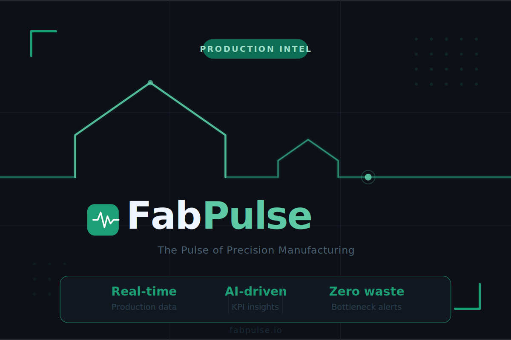

# FabPulse — The Pulse of Precision Manufacturing

> Real-time operational intelligence for off-site construction fabrication plants.



[](LICENSE)
[](https://cloud.google.com/vertex-ai)
[](https://cloud.google.com/run)
[](https://supabase.com)

---

## What Is FabPulse?

FabPulse transforms analog fabrication plants into data-driven operations. Truss plants, wall panel manufacturers, and floor system builders design with precision engineering software — but manage their production floors with spreadsheets, whiteboards, and institutional memory.

FabPulse closes that gap.

Every station, every batch, every labor hour becomes a real-time data point. AI turns that data into decisions — not just dashboards.

**Live demo:** [app.fabpulse.io](https://app.fabpulse.io)
**Landing page:** [fabpulse.io](https://fabpulse.io)

---

## Core Features

### Kiosk PWA — Plant Floor Interface
- Workers log task start/stop events with a single tap
- Fullscreen kiosk lock — no accidental navigation
- **Fully offline:** works when factory Wi-Fi drops
- Background Sync — queued data flushes automatically on reconnect
- Zero data loss on network outages

### Manager Dashboard — Real-Time Visibility
- Live job board: every active job, station, worker, and elapsed time
- **Labor Efficiency Index (LEI):** engineering hours vs. actual floor time
- Station yield and lead time tracking
- Live attendance board
- Job dispatch: assign, prioritize, and annotate from the cloud

### SEC Simulator — Predictive Scheduling (Vertex AI)
The Scheduled End of Construction Simulator answers the question every plant manager dreads: *"When will this job actually be done?"*

Monte Carlo simulation running on Gemini 1.5 Pro outputs three statistically grounded delivery dates:

| Confidence | Use Case |
|---|---|
| P50 | Most likely completion under current conditions |
| P70 | Confident estimate for client commitments |
| P95 | Conservative date for high-stakes contracts |

Adjust attendance, shift hours, or job priority — predictions update instantly.

### Generative Reports (Gemini)
Monthly operations reports generated automatically at period close:
- Efficiency trends by station, shift, and job type
- Top performer highlights
- AI-written narrative: what worked, what didn't, three recommended actions
- PDF export, no manual input required

### Anomaly Detection *(in development)*
Flags stations exceeding their historical lead time baseline — before it cascades into a missed delivery.

### Multi-Plant Dashboard *(in development)*
Unified view across multiple facilities for companies operating more than one plant.

---

## Architecture

```
Manager Dashboard (React + TypeScript + Vite)
        │
        ▼
   FastAPI Backend ──── Google Cloud Run
        │
        ├── Supabase (PostgreSQL + Realtime + Auth + RLS)
        ├── Vertex AI — Gemini 1.5 Pro
        ├── Firebase (offline sync bridge)
        └── BigQuery (analytics + AI execution logs)

Kiosk PWA (React + Workbox Service Worker)
        │
        ├── Online  → POST tasks to API (< 500ms)
        └── Offline → IndexedDB queue → Background Sync on reconnect
```

Full architecture documentation: [`docs/ARCHITECTURE.md`](docs/ARCHITECTURE.md)

---

## Tech Stack

| Layer | Technology |
|---|---|
| Backend | Python 3.12, FastAPI, SQLAlchemy, Alembic |
| Frontend | React 18, TypeScript, Vite, Tailwind CSS |
| PWA / Offline | Workbox, IndexedDB, Background Sync API |
| Database | PostgreSQL via Supabase, Supabase Realtime |
| Auth | Supabase Auth, JWT, Row Level Security |
| AI | Vertex AI — Gemini 1.5 Pro |
| Cloud | Google Cloud Run, Firebase, BigQuery, Cloud Logging |
| Payments | Stripe (subscriptions) |
| DevOps | Docker, GitHub Actions, Google Cloud Build |

---

## Getting Started

### Prerequisites

- Python 3.12+
- Node.js 20+
- Docker
- A Supabase project
- A Google Cloud project with Vertex AI enabled
- A Stripe account

### 1. Clone the repo

```bash
git clone https://github.com/YOUR-USERNAME/fabpulse.git
cd fabpulse
```

### 2. Set up environment variables

```bash
cp .env.example .env
```

Fill in your keys — see [`.env.example`](.env.example) for all required variables.

### 3. Run the backend

```bash
cd apps/api
pip install -r requirements.txt
alembic upgrade head
uvicorn main:app --reload
```

### 4. Run the dashboard

```bash
cd apps/dashboard
npm install
npm run dev
```

### 5. Run the kiosk

```bash
cd apps/kiosk
npm install
npm run dev
```

### 6. Deploy to Google Cloud Run

```bash
gcloud run deploy fabpulse-api \
  --source apps/api \
  --region us-central1 \
  --allow-unauthenticated
```

---

## Project Structure

```
fabpulse/
├── apps/
│   ├── api/                  # FastAPI backend
│   │   ├── routers/          # Auth, jobs, tasks, analytics, simulator, reports
│   │   ├── services/         # Vertex AI, Monte Carlo, PDF generation
│   │   ├── db/               # Schema + migrations
│   │   └── Dockerfile
│   ├── dashboard/            # Manager React app
│   │   └── src/
│   │       ├── pages/        # JobBoard, Analytics, Simulator, Reports, Admin
│   │       └── components/
│   └── kiosk/                # PWA for workstations
│       └── src/
│           ├── pages/        # CheckIn, ActiveJob, TaskComplete
│           └── offline/      # IndexedDB queue + Background Sync
├── packages/
│   ├── shared-types/         # TypeScript interfaces
│   └── ui/                   # Shared React components
├── docs/
│   ├── ARCHITECTURE.md
│   ├── SCHEDULE.md
│   ├── MVP-SCOPE.md
│   └── assets/
├── infrastructure/
│   ├── cloudbuild.yaml
│   └── cloudrun.yaml
├── CLAUDE.md                 # AI coding context
└── README.md
```

---

## Pricing

| Tier | Target | Price |
|---|---|---|
| **Starter** | 1 plant, up to 5 stations | $299/month |
| **Growth** | 1 plant, unlimited stations | $599/month |
| **Pro** | Multi-plant, API access, custom reports | $1,499/month |

[Start your free trial →](https://fabpulse.io)

---

## The Origin Story

This didn't start as a startup idea. It started as a frustration.

I'm an electronics engineer specialized in industrial control and instrumentation. Five years ago, I moved from Colombia to Canada and started working at a truss and wall panel manufacturing plant — not as an engineer, but as a production worker.

I watched people spend entire shifts transcribing production data by hand — cut times, assembly times, lumber quantities, metal plates — copied row by row into spreadsheets that were already wrong by the time they were finished.

I had a computer at my station. So I built a solution with what I had: Microsoft Excel's Visual Basic editor. Station files that talked to each other. A manager dashboard. Real-time data. No more transcription.

It worked. My coworkers started using it. The data got cleaner. The manager started trusting the numbers.

From Excel VBA → Python analytics → FastAPI backend → Vertex AI.

That evolution is FabPulse.

---

## Hackathon

Built for the **XPRIZE x Google — Build with Gemini** hackathon.

- **Category:** Small Business Services
- **Deadline:** August 17, 2026
- [Devpost submission →](https://devpost.com/YOUR-SUBMISSION-LINK)

---

## Roadmap

- [x] Kiosk PWA with offline sync
- [x] Manager dashboard (real-time)
- [x] Labor Efficiency Index (LEI)
- [x] SEC Simulator (Monte Carlo via Vertex AI)
- [x] Generative monthly reports (Gemini)
- [x] Multi-tenant SaaS (Stripe billing)
- [ ] Anomaly detection *(in development)*
- [ ] Multi-plant dashboard *(in development)*
- [ ] MiTek / Alpine bidirectional integration
- [ ] Mobile batch tracking (QR / barcode scanning)

---

## License

MIT — see [LICENSE](LICENSE) for details.

---

## Contact

**Javier** — Builder, electronics engineer, former truss plant worker.

[fabpulse.io](https://fabpulse.io) · [hello@fabpulse.io](mailto:hello@fabpulse.io)

---

> *The plant floor has always had a pulse. I built the monitor.*
